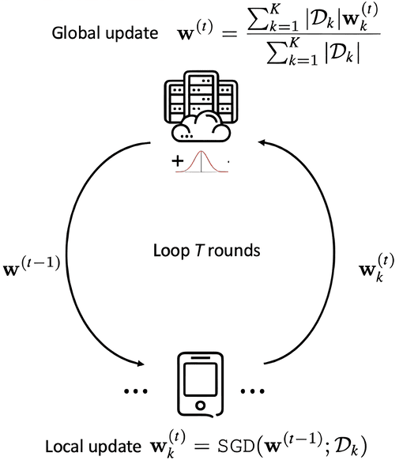

=============================
Federated Learning Strategies
=============================

This page explains the federated learning strategies implemented in ICOS-FL.

Federated Averaging (FedAvg)
----------------------------

ICOS-FL primarily uses Federated Averaging (FedAvg), the most widely used federated learning algorithm.

Algorithm Overview
~~~~~~~~~~~~~~~~~~

   Federated Averaging (FedAvg) Algorithm

The FedAvg algorithm works as follows:

1. Initialize global model parameters ``w₀``
2. For each round ``t = 1, 2, ...``:
   a. Server selects a subset of clients ``C_t``
   b. Server sends current global model ``w_t`` to selected clients
   c. Each selected client ``k`` trains on local data to compute update ``w_t^k``
   d. Clients send their updates back to the server
   e. Server aggregates updates to create new global model: ``w_{t+1} = Σ(n_k/n) · w_t^k``
   where ``n_k`` is the number of samples at client ``k`` and ``n`` is the total number of samples

Mathematical Formulation
~~~~~~~~~~~~~~~~~~~~~~~~

FedAvg minimizes the objective function:

.. math::

   \min_{w} F(w) = \sum_{k=1}^{K} \frac{n_k}{n} F_k(w)

where:
- :math:`F_k(w)` is the local objective function for client :math:`k`
- :math:`n_k` is the number of samples at client :math:`k`
- :math:`n = \sum_{k=1}^{K} n_k` is the total number of samples across all clients
- :math:`K` is the total number of clients

Implementation in ICOS-FL
~~~~~~~~~~~~~~~~~~~~~~~~~

ICOS-FL implements FedAvg in the ``CustomFedAvg`` class:

.. code-block:: python

   class CustomFedAvg(FedAvg):
       """Custom FedAvg strategy for ICOS-FL."""

       def aggregate_fit(
           self,
           server_round: int,
           results: List[Tuple[ClientProxy, FitRes]],
           failures: List[Union[Tuple[ClientProxy, FitRes], BaseException]],
       ) -> Tuple[Optional[Parameters], Dict[str, Scalar]]:
           # Aggregate model updates from clients
           # ...

This implementation extends Flower's base FedAvg strategy with:

1. Model checkpoint saving
2. Metrics tracking with Weights & Biases
3. Best model selection based on validation metrics

Configuration Parameters
~~~~~~~~~~~~~~~~~~~~~~~~

ICOS-FL exposes several parameters for configuring the FedAvg strategy:

.. list-table::
   :header-rows: 1
   :align: left

   * - Parameter
     - Default
     - Description
   * - fraction_fit
     - 1.0
     - Fraction of clients to select for training
   * - fraction_evaluate
     - 1.0
     - Fraction of clients to select for evaluation
   * - min_fit_clients
     - 2
     - Minimum number of clients for training
   * - min_evaluate_clients
     - 2
     - Minimum number of clients for evaluation
   * - min_available_clients
     - 2
     - Minimum clients before starting a round

Client Selection
~~~~~~~~~~~~~~~~

ICOS-FL selects clients for participation in each round based on:

1. Availability: Clients must be connected and ready
2. Minimum threshold: At least ``min_available_clients`` must be available
3. Selection fraction: ``fraction_fit`` of available clients are selected
4. Prioritization: Random selection by default

Aggregation Functions
~~~~~~~~~~~~~~~~~~~~~

ICOS-FL implements custom aggregation functions for metrics:

.. code-block:: python

   def train_metrics_aggregation(metrics: List[Tuple[int, Metrics]]) -> Metrics:
       """Aggregate training metrics from multiple clients."""
       # ...
       return {
           "train_loss": weighted_loss / total_examples,
           "train_accuracy": weighted_accuracy / total_examples,
       }

   def evaluate_metrics_aggregation(metrics: List[Tuple[int, Metrics]]) -> Metrics:
       """Aggregate evaluation metrics from multiple clients."""
       # ...
       return {
           "val_loss": weighted_loss / total_examples,
           "accuracy": weighted_accuracy / total_examples,
       }

These functions compute weighted averages of metrics based on the number of samples at each client.

Advanced Strategies
-------------------

While FedAvg is the primary strategy, ICOS-FL supports or can be extended to support more advanced approaches:

Federated Stochastic Gradient Descent (FedSGD)
~~~~~~~~~~~~~~~~~~~~~~~~~~~~~~~~~~~~~~~~~~~~~~

FedSGD is a simpler variant where clients perform a single batch or epoch of training:

- Clients compute gradients on local data for one step
- Server aggregates gradients and updates the global model
- Less communication-efficient but potentially more stable

To implement FedSGD in ICOS-FL, set ``local_epochs = 1`` in the configuration.

Federated Proximal (FedProx)
~~~~~~~~~~~~~~~~~~~~~~~~~~~~

FedProx adds a proximal term to the client objective:

.. math::

   F_k^{FedProx}(w) = F_k(w) + \frac{\mu}{2}||w - w_t||^2

This regularization term keeps client models from diverging too far from the global model, which helps with heterogeneous data.

Adaptive Federated Optimization (FedOpt)
~~~~~~~~~~~~~~~~~~~~~~~~~~~~~~~~~~~~~~~~

FedOpt applies adaptive optimization methods (Adam, Adagrad, etc.) to the server update:

- Clients compute updates using standard optimization
- Server applies adaptive methods to aggregate updates
- Improves convergence speed and stability

This can be implemented by extending the CustomFedAvg class with adaptive optimization logic.

Handling Non-IID Data
---------------------

System metrics across different nodes can be highly non-IID (not identically distributed). ICOS-FL implements several techniques to handle this:

1. **Local Epochs Tuning**: More local epochs helps with non-IID data
2. **Model Architecture**: LSTM architecture is robust to temporal variations
3. **Client Weighting**: Proper weighting based on data quantity and quality
4. **Robust Aggregation**: Metrics like memory usage are normalized across clients

Performance Considerations
--------------------------

When using federated strategies, consider these performance factors:

1. **Communication Overhead**: Balance between frequent communication and local training
2. **Synchronous vs. Asynchronous**: ICOS-FL uses synchronous updates by default
3. **Client Resources**: Adapt local training based on client capabilities
4. **Aggregation Frequency**: Adjust round frequency based on data change rate
5. **Model Size**: LSTM models are relatively compact (~100KB-1MB)

Evaluation and Metrics
----------------------

ICOS-FL tracks these metrics during federated learning:

1. **Training Loss**: MSE on training data at each client
2. **Validation Loss**: MSE on validation data at each client
3. **Centralized Evaluation**: Server-side evaluation on separate data
4. **Prediction Accuracy**: How accurately the model predicts future values
5. **Training Efficiency**: Time per round, communication volume

These metrics are logged and can be visualized through Weights & Biases integration.
