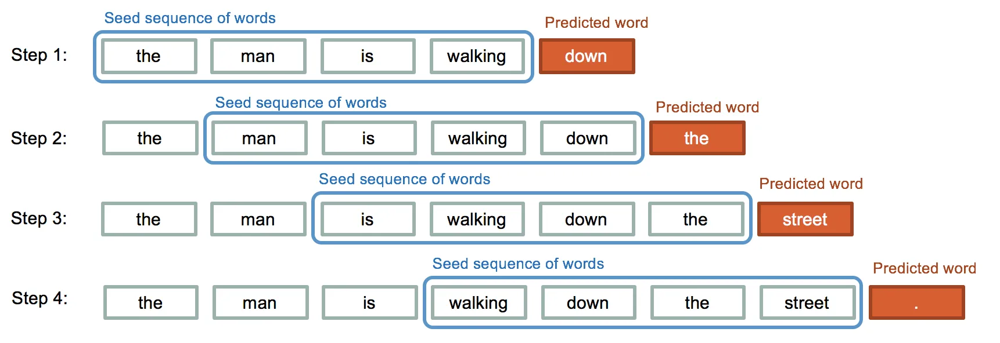

===================
Sequence Prediction
===================

This page explains how ICOS-FL uses LSTM networks for time series prediction of system metrics.

Time Series Prediction Overview
-------------------------------

Time series prediction is the task of forecasting future values based on previously observed values. In ICOS-FL, this involves predicting future resource metrics like CPU usage, memory consumption, and power usage.

   Time Series Prediction with LSTM

The prediction process follows these steps:

1. **Historical Data Collection**: Gather time-ordered system metrics
2. **Sequence Formation**: Create overlapping sequences of fixed length
3. **Model Training**: Train LSTM to map sequences to next values
4. **Prediction**: Use trained model to forecast future values

Input Data Characteristics
--------------------------

ICOS-FL works with several types of system metrics:

.. list-table::
   :header-rows: 1
   :align: left

   * - Metric
     - Typical Range
     - Characteristics
   * - CPU Usage
     - 0-100%
     - Fluctuating, often cyclical patterns
   * - Memory Usage
     - 0-100%
     - More stable with occasional steps/spikes
   * - Power Consumption
     - Varies by system
     - Correlated with CPU but with unique patterns

These metrics pose specific challenges:

1. **Multiscale Patterns**: Daily, hourly, and minute-level patterns
2. **Non-stationarity**: Statistical properties change over time
3. **Noise**: Measurements contain random variations
4. **Spikes and Anomalies**: Sudden changes in resource usage

Sequence Formation
------------------

ICOS-FL transforms raw time series into sequences suitable for LSTM processing:

.. code-block:: text

   Raw Time Series: [v₁, v₂, v₃, v₄, v₅, v₆, v₇, v₈, v₉, ...]

   Sequence 1: [v₁, v₂, v₃, v₄, v₅] → Target: v₆
   Sequence 2: [v₂, v₃, v₄, v₅, v₆] → Target: v₇
   Sequence 3: [v₃, v₄, v₅, v₆, v₇] → Target: v₈
   ...

This sliding window approach creates a supervised learning problem, where each sequence is an input and the next value is the target.

Data Preprocessing
------------------

Before feeding data to the LSTM, ICOS-FL applies these preprocessing steps:

1. **Cleaning**: Handle missing values and outliers
2. **Normalization**: Scale features to zero mean and unit variance
3. **Sequencing**: Create overlapping sequences with ``time_step`` length
4. **Split**: Divide into training and validation sets
5. **Batching**: Group sequences into batches

The normalization step is particularly important:

.. code-block:: python

   def _normalize_data(self, df: pd.DataFrame) -> pd.DataFrame:
       """Normalize the dataset using standardization."""
       scaler = StandardScaler()
       normalized_data = scaler.fit_transform(df)
       return pd.DataFrame(normalized_data, columns=df.columns, index=df.index)

Single-Step vs. Multi-Step Prediction
-------------------------------------

ICOS-FL supports both prediction approaches:

Single-Step Prediction
~~~~~~~~~~~~~~~~~~~~~~

Predicts one time step into the future:

- **Input**: Sequence of length time_step
- **Output**: Single value prediction
- **Advantage**: Higher accuracy for immediate forecasting
- **Use Case**: Short-term resource planning

Multi-Step Prediction
~~~~~~~~~~~~~~~~~~~~~

Predicts multiple steps into the future:

- **Method 1: Recursive**: Use single-step predictions as inputs for future steps
- **Method 2: Direct**: Train model to output multiple future values directly
- **Method 3: Sequence-to-Sequence**: Encoder-decoder architecture for varied output lengths

ICOS-FL primarily uses the recursive approach for multi-step prediction:

.. code-block:: python

   def predict_multi_step(model, initial_sequence, steps=5):
       """Predict multiple steps ahead using recursive approach."""
       predictions = []
       curr_seq = initial_sequence.clone()

       for _ in range(steps):
           # Get next prediction
           with torch.no_grad():
               next_pred = model(curr_seq)

           # Add prediction to results
           predictions.append(next_pred.item())

           # Update sequence by removing oldest value and adding prediction
           curr_seq = torch.cat((curr_seq[:, 1:], next_pred.unsqueeze(0).unsqueeze(0)), dim=1)

       return predictions

Model Evaluation
----------------

ICOS-FL evaluates prediction quality using several metrics:

1. **Mean Squared Error (MSE)**: Primary loss function for training

   .. math::

      MSE = \frac{1}{n} \sum_{i=1}^{n} (y_i - \hat{y}_i)^2

2. **Root Mean Squared Error (RMSE)**: More interpretable in original scale

   .. math::

      RMSE = \sqrt{MSE}

3. **Mean Absolute Error (MAE)**: Less sensitive to outliers

   .. math::

      MAE = \frac{1}{n} \sum_{i=1}^{n} |y_i - \hat{y}_i|

These metrics are calculated on a validation set to assess model performance.

Prediction Challenges
---------------------

Time series prediction in ICOS-FL faces several challenges:

1. **Edge Cases**:
   - Sudden resource spikes
   - System restarts
   - Resource exhaustion

2. **Pattern Shifts**:
   - Changing workloads
   - System updates/modifications
   - Hardware changes

3. **Prediction Horizon**:
   - Accuracy decreases with prediction distance
   - Error accumulation in recursive forecasting

ICOS-FL addresses these challenges through:

- Regular retraining
- Federated aggregation of diverse patterns
- Confidence intervals for predictions
- Anomaly detection for unexpected patterns

Practical Applications
----------------------

ICOS-FL's sequence prediction capabilities enable several practical applications:

Resource Planning
~~~~~~~~~~~~~~~~~

- **Proactive Scaling**: Increase resources before demand spikes
- **Power Management**: Optimize power usage based on predicted loads
- **Maintenance Scheduling**: Plan maintenance during predicted low-usage periods

Anomaly Detection
~~~~~~~~~~~~~~~~~

- **Deviation Analysis**: Flag when actual values diverge from predictions
- **Pattern Violation**: Identify unusual sequences in resource usage
- **Failure Prediction**: Detect patterns that precede system failures

Capacity Optimization
~~~~~~~~~~~~~~~~~~~~~

- **Right-sizing**: Allocate appropriate resources based on predicted needs
- **Load Balancing**: Distribute workloads based on predicted resource availability
- **Cost Reduction**: Minimize over-provisioning through accurate forecasting

Federated Learning Benefits
---------------------------

Federated learning enhances sequence prediction by:

1. **Pattern Diversity**: Learning from varied system behaviors across nodes
2. **Generalization**: Capturing common patterns while filtering node-specific noise
3. **Continuous Improvement**: Adapting to new patterns as they emerge
4. **Privacy Preservation**: Keeping raw system metrics private

This approach results in more robust and accurate predictions than single-node learning.
